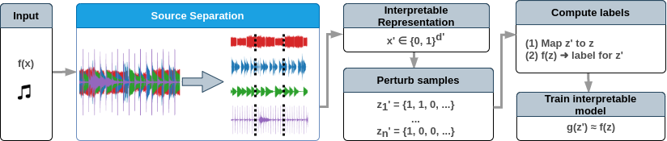

# audioLIME



This repository contains the Python package audioLIME, a tool for creating listenable explanations
for machine learning models in music information retrival (MIR).
audioLIME is based on the method LIME (local interpretable model-agnostic explanations), work 
presented in [this paper](https://arxiv.org/abs/1602.04938) and uses source separation estimates in
order to create interpretable components. Alternative types of interpretable components are available 
(see the last section) and more will be added in the future.

## Citing

If you use audioLIME in your work, please cite it:

```bibtex
@misc{haunschmid2020audiolime,
    title={{audioLIME: Listenable Explanations Using Source Separation}},
    author={Verena Haunschmid and Ethan Manilow and Gerhard Widmer},
    year={2020},
    eprint={2008.00582},
    archivePrefix={arXiv},
    primaryClass={cs.SD},
    howpublished={13th International Workshop on Machine Learning and Music}
}
```

## Publications

audioLIME is introduced/used in the following publications:

* Verena Haunschmid, Ethan Manilow and Gerhard Widmer, *audioLIME: Listenable Explanations Using Source Separation* 
  * paper: [arxiv](https://arxiv.org/abs/2008.00582)
  * code: [branch `mml2020`](https://github.com/CPJKU/audioLIME/tree/mml2020) and [mml2020-experiments](https://github.com/expectopatronum/mml2020-experiments/)

* Verena Haunschmid, Ethan Manilow and Gerhard Widmer, *Towards Musically Meaningful Explanations Using Source Separation* 
  * paper: [arxiv](https://arxiv.org/abs/2009.02051)

* Alessandro B. Melchiorre, Verena Haunschmid, Markus Schedl and Gerhard Widmer, *LEMONS: Listenable Explanations for Music recOmmeNder Systems*
    * [paper](https://www.springerprofessional.de/en/lemons-listenable-explanations-for-music-recommender-systems/19017596) | [code](https://github.com/CPJKU/LEMONS) | [video](https://www.youtube.com/watch?v=giSPrPnZ7mc)

* Shreyan Chowdhury, Verena Praher and Gerhard Widmer, *Tracing Back Music Emotion Predictions to Sound Sources and Intuitive Perceptual Qualities*
    * to appear in [SMC 2021](https://smc2021conference.org/)
    * [preprint](https://arxiv.org/abs/2106.07787)

* Verena Praher(&ast;), Katharina Prinz(&ast;), Arthur Flexer and Gerhard Widmer, *On the Veracity of Local, Model-agnostic Explanations in Audio Classification*
  * (&ast;) equal contribution
  * [preprint](https://arxiv.org/abs/2107.09045)
  * code: [audioLIME v0.0.3](https://github.com/CPJKU/audioLIME/tree/v0.0.3) and [veracity](https://github.com/CPJKU/veracity/)

## Installation

The audioLIME package is not on PyPI yet. For installing it, clone the git repo and install it using 
`setup.py`.

```sh
git clone https://github.com/CPJKU/audioLIME.git  # HTTPS
```

```sh
git clone git@github.com:CPJKU/audioLIME.git  # SSH
```

```sh
cd audioLIME
python setup.py install
```

To install a version for development purposes 
[check out this article](http://naoko.github.io/your-project-install-pip-setup/).

### Tests

To test your installation, the following test are available (more to come :)):

`python -m unittest tests.test_SpleeterFactorization`

## Note on Requirements

To keep it lightweight, not all possible dependencies are contained in `setup.py`. 
Depending on the factorization you want to use, you might need different packages, 
e.g. `spleeter`. 

### Installation & Usage of spleeter

```sh
pip install spleeter==2.0.2
```
When you're using `spleeter` for the first time, it will download the used model in a directory
`pretrained_models`. You can only change the location by setting an environment variable 
`MODEL_PATH` *before* `spleeter` is imported. There are different ways to 
[set an environment variable](https://www.serverlab.ca/tutorials/linux/administration-linux/how-to-set-environment-variables-in-linux/),
for example:

```sh
export MODEL_PATH=/path/to/spleeter/pretrained_models/
```

## Available Factorizations

Currently we have the following factorizations implemented:

* SpleeterFactorization based on the source separation system spleeter 
([code](https://github.com/deezer/spleeter/))
* TimeFrequencyTorchFactorization: time-frequency segmentation based on 
[SoundLIME](https://github.com/saum25/SoundLIME) 
(the original implementation was not flexible enough for our experiments)
* ImageLikeFactorization: super pixel segmentation, as proposed in the 
[original paper](https://arxiv.org/abs/1602.04938) used for images.
